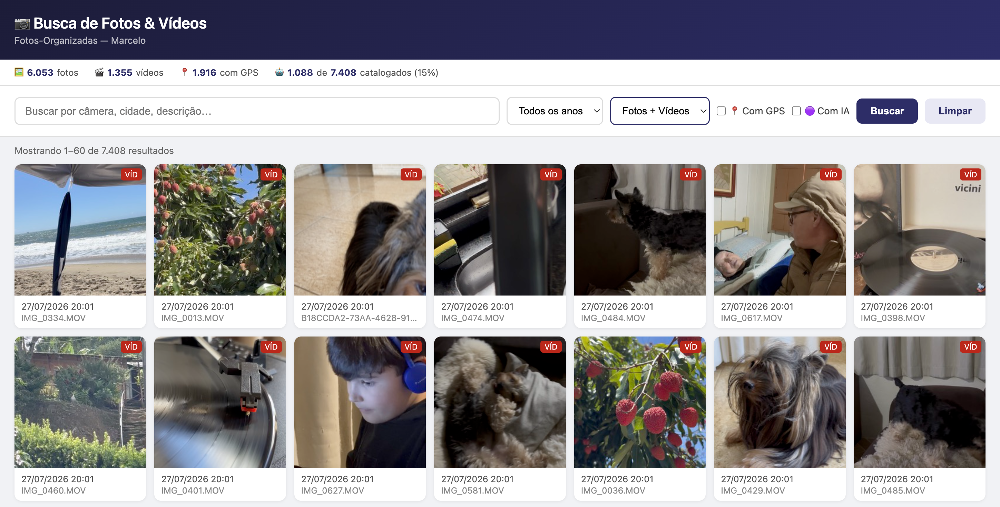

# fotosearch

Busca local de fotos e vídeos por palavras-chave, com descrições geradas por IA (Gemini).



## O que faz

- **Busca por texto** — encontra fotos e vídeos pela descrição gerada pela IA, tags, cidade, câmera
- **Thumbnails reais de vídeo** — frames extraídos automaticamente via `qlmanage` (sem dependências externas)
- **Modal com fullscreen** — visualização ampliada com navegação por teclado, player de vídeo integrado
- **Filtros** — por ano, tipo (foto/vídeo), GPS, catalogados com IA
- **Enriquecimento automático** — `enricher.py` usa Gemini para gerar descrição e tags de cada arquivo
- **Compartilhamento** — fotos copiadas direto para clipboard; vídeos revelados no Finder
- **Exclusão com confirmação** — remove do disco e do banco em um clique
- **Leitura em voz alta** — descrição da IA lida com síntese de voz em português

## Stack

- Python 3 (`http.server`, `sqlite3`) — sem frameworks
- SQLite com FTS5 para busca textual
- HTML + JS vanilla + Bootstrap 5
- Google Gemini (`gemini-2.5-flash-lite`) para descrições e tags (FREE tier)

## Requisitos

- macOS (usa `sips` e `qlmanage` para thumbnails)
- Python 3.9+
- Chave de API Gemini (gratuita em [aistudio.google.com](https://aistudio.google.com/apikey))

## Instalação

```bash
git clone https://github.com/marcelosicuro/fotosearch.git
cd fotosearch
pip install google-genai
cp .env.example .env
# edite .env e adicione sua GEMINI_API_KEY
```

## Uso

```bash
# 1. Indexar a coleção (ajuste o caminho)
python3 indexer.py --dir ~/Pictures

# 2. Enriquecer com IA (processa ~300–500 arquivos/dia no plano gratuito)
python3 enricher.py --limit 1400

# 3. Iniciar o servidor
python3 server.py
# Acesse: http://localhost:5050
```

## Acesso pelo iPhone

O servidor escuta em `0.0.0.0:5050`. Acesse pelo IP do Mac na rede local:

```
http://192.168.x.x:5050
```
